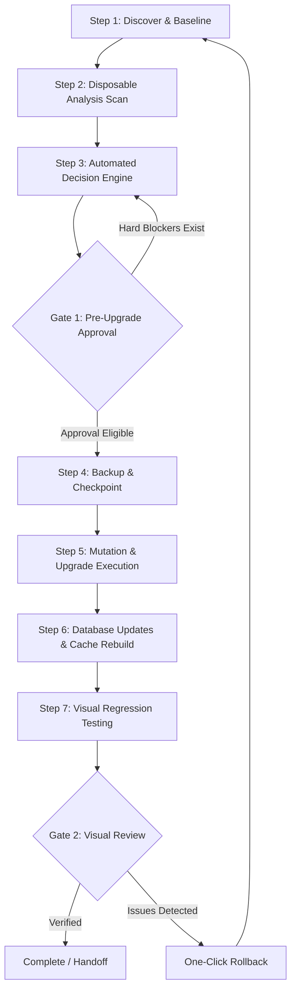

# AGENTS.md — Drupal 11 Upgrade Toolkit

## Overview

The **D11 Upgrade Toolkit** is an automated, project-agnostic toolkit for conducting deterministic **Drupal 10 → Drupal 11 upgrade rehearsals, verification, and rollbacks**.

It is designed to work with **any Drupal project** on macOS or Linux, supporting any local development environment (**Docksal, DDEV, Lando, Docker Compose, or custom Docker setups**).

The toolkit guarantees **100% non-destructive rehearsals**:
- Discovery and audit scans run inside a disposable Docker MariaDB container, leaving the developer's live database and source code untouched.
- Upgrade rehearsals take a zero-copy Git snapshot and gzipped database backup (`pre-upgrade.sql.gz`) before making any changes.
- Rollback can be executed at any time in one click or command, restoring the exact pre-upgrade state and leaving a clean working tree.

---

## AI Agents & Automation Capabilities

Several AI assistants interact with this repository and target Drupal projects:

| Agent / Context | Role | Primary Actions |
| :--- | :--- | :--- |
| **`agy` (Antigravity Core)** | Autonomous pairing & orchestration | Runs commands, modifies codebase, launches rehearsals, monitors background tasks. |
| **`research` (Read-only)** | Codebase exploration | Searches files, inspects module code, checks deprecations without modifying files. |
| **Claude Code / Cursor / Codex** | Development & review | Follows guidelines in `CLAUDE.md`, implements fixes, synchronizes toolkit mirrors. |

---

## Architecture & The Two-Gate Safety Workflow

The toolkit operates through a deterministic **Two-Gate** lifecycle:



### 1. Gate 1: Audit, Evidence & Planning
- **Disposable Analysis Environment**: Drush, Upgrade Status, and Drupal Rector execute inside an isolated MariaDB container (`db:3306`). Database caching is used to avoid external Redis/Memcache requirements. The user's live database is never touched during the audit.
- **Automated Compatibility Decisions**:
  - **`compatible_release`**: Chosen when Drupal.org has published a compatible D11 release.
  - **`keep`**: Strictly allowed **only** when an extension is 100% clean (`status: ready`, 0 deprecations, 0 PHPStan issues). If an extension has deprecations, it must use `compatible_release` or remediation.
  - **`remove`**: Automatically chosen for obsolete performance modules superseded by Drupal 11 core (e.g., `advagg`, `advagg_mod`) or uninstalled/unexported contrib extensions.
  - **`ai_manual_patch` / `manual_remediation`**: Deterministic Rector diffs or AI-assisted patches with SHA-256 validation.
- **Gate 1 Approval**: Validates that all extensions are resolved (0 unresolved, 0 defer), Composer resolution succeeds, and SHA-256 evidence digests (`approvalDigest`) match.

### 2. Mutation & Upgrade Execution
- Creates `recovery-checkpoint` containing:
  - Database snapshot: `pre-upgrade.sql.gz`
  - Git commit hash: `gitHead`
- Uninstalls obsolete performance modules via Drush.
- Applies custom code refactoring diffs.
- Executes `composer update` / `install` to upgrade core to Drupal 11.4.x.
- Runs `drush updatedb --yes` and `drush cache:rebuild`.
- Probes `drush core:status` to verify bootstrap and database connectivity.

### 3. Gate 2: Verification & Rollback
- Automated visual regression test captures screenshots across baseline routes and generates visual diffs.
- **Rollback (`guided-rollback`)**: Restores `pre-upgrade.sql.gz`, resets Git branch to the pre-upgrade commit, re-runs Composer install to restore pre-upgrade vendor packages, and verifies site health with HTTP 200.

---

## Quick Start — Using with Any Drupal Project

### Prerequisites
- A Drupal 10 project managed with Composer.
- A running local development environment (**Docksal**, **DDEV**, **Lando**, or **Docker Compose**).
- The local site must be reachable via its dev URL (e.g. `http://my-project.docksal.site`).

---

### 0. One-Time Workbench Setup

```bash
cd /path/to/promet-drupal-workbench
./bin/d11 setup       # Auto-creates isolated .venv and installs all dependencies
./bin/d11 doctor      # Verifies Docker, Git, Python environment health
```

---

### Method 1: The Drupal Upgrade Workbench (Recommended UI)

The **Drupal Upgrade Workbench** is the interactive single-page visual application providing step-by-step control over project intake, scans, Gate 1 reviews, 1-click upgrades, visual diffs, and instant rollbacks. See [docs/dashboard.md](docs/dashboard.md) for the complete operator guide.

1. **Start the Dashboard Server**:
   ```bash
   cd /path/to/promet-drupal-workbench
   ./bin/d11 dashboard --port 8765
   ```
2. Open **[http://localhost:8765](http://localhost:8765)** in your browser.
3. Click **+ Add Project**:
   - **Project Name**: Short identifier (e.g., `my-drupal-site`).
   - **Source Directory**: Absolute path to your Drupal project repository (e.g., `/path/to/my-drupal-site`).
   - **Site URL**: Local URL (e.g., `http://my-drupal-site.docksal.site`).
4. Click **Add project → Scan**:
   - The toolkit will auto-detect the Docker environment, capture route baselines, and run Upgrade Status and Rector in the analysis container.
5. Review the **Gate 1 Upgrade Proposal**:
   - Extensions are auto-categorized into `compatible_release`, `keep`, `remove`, and `manual_remediation`.
   - Ensure risk status is `Conditional Go` or `Go` with **0 hard blockers**.
6. Click **Start 1-Click Upgrade →**:
   - A safety confirmation modal appears summarizing planned removals and updates.
   - Click **Confirm & Start Upgrade →**.
   - The tool takes the database backup, executes Composer upgrades, runs schema updates, rebuilds cache, and captures Gate 2 visual tests.
7. **Rollback (Optional)**:
   - To return the site to its original Drupal 10 state, click **Rollback to Pre-Upgrade State**.

---

### Method 2: The CLI Runner

You can execute the entire workflow non-interactively from the terminal:

```bash
cd /path/to/your-drupal-project

# 1. Initialize project
<WORKBENCH_PATH>/bin/d11 init . -y \
  --url http://my-project.docksal.site \
  --project my-project

# 2. Run end-to-end upgrade rehearsal
<WORKBENCH_PATH>/bin/d11 upgrade . -y

# 3. Rollback when rehearsal is verified
RUN_ID=$(<WORKBENCH_PATH>/bin/d11 workflow runs --project my-project | jq -r '.[0].id')
<WORKBENCH_PATH>/bin/d11 workflow rollback --project my-project --run "$RUN_ID"
```

---

## Developer & Agent Rules

When modifying or running the toolkit:

1. **Centralized & Non-Invasive Workbench (No Embedded Tooling)**:
   - The **Drupal Upgrade Workbench** is a central, standalone engine. Developers can clone and run it from any directory of their choice (e.g. `~/Sites/promet-drupal-workbench`, `/Users/Shared/promet-drupal-workbench`, etc.).
   - **Never copy, embed, or synchronize the toolkit into client Drupal repositories.** Drupal project repositories must remain clean without extra tooling overhead. The Workbench interacts with projects externally via their path and local URL.
2. **Keep Decision Invariant**:
   - An extension must **never** be assigned `action: "keep"` if `row.status !== "ready"` or if deprecations/PHPStan issues exist. Any extension with code findings must be assigned `compatible_release` (or patch/remediation).
3. **No Direct Source Mutations During Audit**:
   - Audit scans must only execute inside the disposable container. The developer's project files and database must never be modified prior to Gate 1 approval.
4. **Argv-Only Subprocess Executions**:
   - All subprocess commands must be passed as lists of strings (`argv: list[str]`). Never execute raw shell concatenation strings or use `shell=True`.
5. **Smart Static Analysis (Skip Contrib PHPStan, Focus on Custom & Remediations)**:
   - Contrib modules already adhere to Drupal.org community standards and their D11 versions are resolved by Composer.
   - Deep PHPStan and Rector scanning strictly focuses on **custom code** (`modules/custom`, `themes/custom`) and **remediations/patches** (`ai_manual_patch`, `manual_remediation`, community MRs).
   - Contrib PHPStan is skipped via `--ignore-contrib` to avoid redundant multi-minute scans on obsolete D10 contrib files.
6. **Localhost & Local Dev Environment Executions (Docksal, Lando, DDEV, Loopback)**:
   - For local probes, health checks, or API requests targeting `localhost`, `127.0.0.1` (on any port), Docksal (`*.docksal.site`, `*.docksal`), Lando (`*.lndo.site`, `*.lando.site`), or DDEV (`*.ddev.site`), agents must run `curl` inside the standard sandbox (`BypassSandbox: false`) directly without asking for manual permission or bypass, as local dev and loopback traffic executes automatically without prompting.
   - Standard environment CLI commands (`fin`, `lando`, `ddev`, `docker`) should also be run sandboxed first without prompting for manual confirmation.
7. **Read-Only Metadata & Inspection Scripts (`~/.d11`, JSON, Python)**:
   - Reading configuration files, manifests, or visual diff metadata in `~/.d11` is strictly read-only and safe.
   - Agents must run inspection scripts (`python3`, `jq`, `cat`) inside the standard sandbox (`BypassSandbox: false`) or use native `view_file` tools, never requesting sandbox bypass for reading project metadata.

---

## Troubleshooting Guide

### 1. "Only one workflow may run at a time"
Another process holds the workflow lock or a previous command was aborted:
```bash
rm -f ~/.d11/workflow.lock
```

### 2. "58 extension compatibility decisions remain unresolved" (or similar count)
This occurs if the frontend or user submitted `action: "keep"` on extensions that have deprecation notices.
- Ensure the latest frontend code is loaded by hard-refreshing the browser (**`Cmd + Shift + R`**).
- The toolkit's `auto_decide` will automatically align these to `compatible_release` with risk acceptance.

### 3. "Source runtime is stopped or ambiguous"
The toolkit requires exactly one running container matching the project root:
- Check running containers with `fin ps`, `ddev list`, or `docker ps`.
- Stop any unrelated Docker stacks that may share container names.
- Restart your project environment: `fin up` or `ddev start`.

### 4. Restarting the Dashboard Service
If the dashboard needs to be restarted:
```bash
# Locate existing dashboard process on port 8765
lsof -i :8765
kill <PID>

# Start anew from the workbench directory
./bin/d11 dashboard --port 8765 --no-open
```
