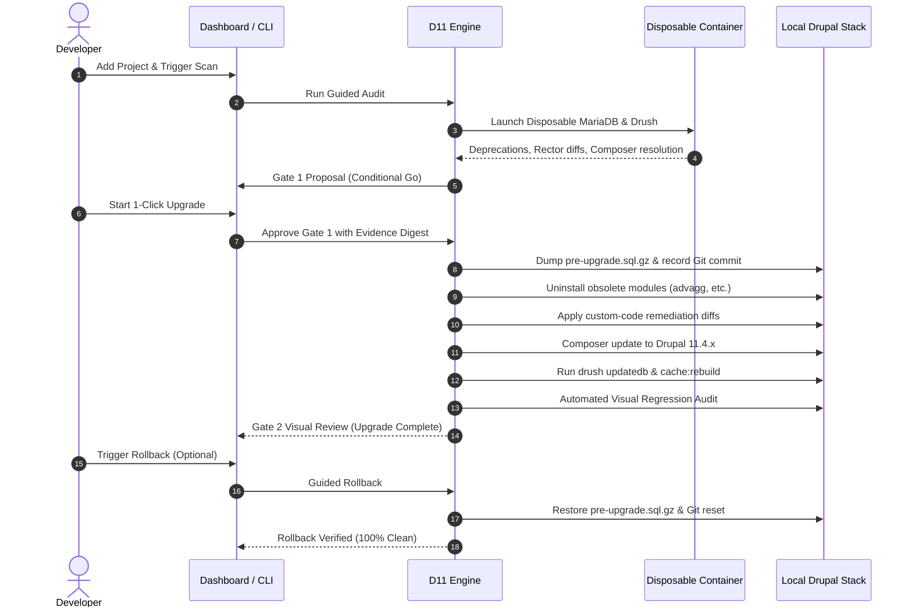

# Drupal 11 Upgrade Toolkit

An automated, repository-aware toolkit for conducting deterministic **Drupal 10 → Drupal 11 upgrade rehearsals, verification, and rollbacks**.

Works with **any Drupal project** across any local development environment (**Docksal, DDEV, Lando, Docker Compose, or custom Docker setups**).

---

## Key Highlights

- 🛡️ **100% Non-Destructive Scans**: Audits and static analysis run inside an ephemeral MariaDB analysis container (`db:3306`), leaving your host database and codebase untouched.
- 🚀 **1-Click Upgrade Rehearsal**: Auto-resolves compatibility decisions, refactors custom code, applies community patches, upgrades Composer dependencies to Drupal 11, runs schema migrations, and verifies routes.
- 🔄 **One-Click Instant Rollback**: Automatically restores a full database snapshot (`pre-upgrade.sql.gz`) and resets Git to the pre-upgrade commit, returning your working tree to a completely clean state.
- 🔍 **Automated Visual Regression**: Captures baseline screenshots across key site routes and compares them against the upgraded site at Gate 2.

---

---

## ⚡ Quick Setup in 60 Seconds

You only need **three commands** to get started:

```bash
# 1. Clone this repository
git clone <repo-url> promet-drupal-workbench
cd promet-drupal-workbench

# 2. One-time bootstrap (creates .venv and installs all dependencies automatically)
./bin/d11 setup

# 3. Launch the visual workbench!
./bin/d11 dashboard
```

> 🌐 Open **[http://localhost:8765](http://localhost:8765)** in your browser.
> You're now ready to add any Drupal project and run safe, non-destructive upgrade rehearsals!

---

## Installation & Prerequisites

### System Requirements

| Requirement | Notes |
| :--- | :--- |
| **Operating System** | macOS or Linux (Windows supported via WSL2) |
| **Python 3.9+** | Standard system Python; `./bin/d11 setup` manages its own isolated `.venv` |
| **Docker Engine / Desktop** | Required for the disposable audit MariaDB container and visual regression tests |
| **Git** | For zero-copy upgrade checkpoints and 1-click rollback |
| **Local Drupal 10 Project** | Running on Docksal (`fin`), DDEV (`ddev`), Lando (`lando`), or Docker Compose |
| **AI Provider Key** | _(Optional)_ Only needed for AI custom code patches; can be added in `.env` or in the UI Settings tab |

> [!NOTE]
> **Zero Host Tooling Required**: You do **not** need Composer, Drush, PHP, Node.js, or Backstop.js installed on your host machine. All heavy analysis and audit tooling executes inside disposable Docker containers.

---

### Step-by-Step Installation Guide

#### 1. Clone the Workbench
Clone the workbench repository into any directory on your machine (e.g. `~/Sites/promet-drupal-workbench` or `/Users/Shared/promet-drupal-workbench`):
```bash
git clone <repo-url> promet-drupal-workbench
cd promet-drupal-workbench
```

#### 2. Bootstrap the Toolkit
Run the setup command. It will automatically detect Python 3, create a dedicated `.venv`, and install required dependencies:
```bash
./bin/d11 setup
```

#### 3. Verify Environment Health
Run the built-in diagnostic doctor to verify Docker, Git, Python, and local runtime accessibility:
```bash
./bin/d11 doctor
```
If all checks pass (marked with green checkmarks), your machine is 100% ready.

#### 4. (Optional) Configure AI Providers
If you want to use Google Gemini, Claude, or OpenAI for automated custom code patch generation:
```bash
cp .env.example .env
# Edit .env and paste your API key (e.g., GEMINI_API_KEY=your_key)
```
*(You can also configure API keys later directly in the Workbench UI under the **Settings** tab.)*

#### 5. Launch the Dashboard
```bash
./bin/d11 dashboard --port 8765
```
*(Tip: Add `--no-open` if running on a remote server or headless environment).*

---

## Quick Start Guide

### Prerequisites
1. A local Drupal 10 project managed with Composer.
2. A running local Docker environment (`fin up`, `ddev start`, `lando start`, or `docker compose up -d`).
3. Local site reachable in your browser (e.g. `http://my-project.docksal.site`).

---

### Option A: The Drupal Upgrade Workbench (Fastest & Easiest UI)

The **Drupal Upgrade Workbench** is a browser-based SPA providing full visual control over audits, rehearsals, Gate 2 visual diffs, and instant rollbacks. See the [Drupal Upgrade Workbench Operator Guide](docs/dashboard.md) for an in-depth stage-by-stage walkthrough.

Start the local dashboard server:

```bash
cd /path/to/drupal-upgrade-workbench
./bin/d11 dashboard --port 8765
```

1. Open **[http://localhost:8765](http://localhost:8765)** in your browser.
2. Click **+ Add Project**:
   - Provide your project name, absolute directory path to your Drupal repo, and local URL.
3. Click **Add project → Scan**:
   - The toolkit auto-detects the Docker stack, discovers routes, and runs Upgrade Status + Rector in a disposable container.
4. Review the **Gate 1 Proposal**:
   - See an executive breakdown of modules to upgrade, keep, or remove.
5. Click **Start 1-Click Upgrade →**:
   - Review planned actions in the confirmation modal and click **Confirm & Start Upgrade →**.
   - The tool takes an automated database snapshot, upgrades core to **Drupal 11.4.x**, runs `drush updatedb`, rebuilds caches, and executes visual regression tests.
6. **Rollback Whenever You Want**:
   - Click **Rollback to Pre-Upgrade State** to instantly restore your original database and Git state.

---

### Option B: The CLI Automation Runner

You can execute the exact same upgrade rehearsal non-interactively via the command line:

```bash
cd /path/to/your-drupal-project

# 1. Initialize the project in the toolkit
<WORKBENCH_PATH>/bin/d11 init . -y \
  --url http://my-project.docksal.site \
  --project my-project

# 2. Run the full upgrade rehearsal
<WORKBENCH_PATH>/bin/d11 upgrade . -y

# 3. Roll back after testing
RUN_ID=$(<WORKBENCH_PATH>/bin/d11 workflow runs --project my-project | jq -r '.[0].id')
<WORKBENCH_PATH>/bin/d11 workflow rollback --project my-project --run "$RUN_ID"
```

---

## How the Two-Gate Workflow Works



---

## CLI Command Reference

| Command | Purpose |
| :--- | :--- |
| `d11 dashboard [--port 8765]` | Launch the visual web workbench. |
| `d11 init <path> -y --url <url> --project <name>` | Register a project for automated upgrades. |
| `d11 upgrade <path> -y` | Run the complete end-to-end upgrade rehearsal. |
| `d11 upgrade <path> --dry-run` | Generate the upgrade plan without mutating files. |
| `d11 workflow runs [--project <name>]` | List previous audit, upgrade, and rollback runs. |
| `d11 workflow rollback --project <name> --run <id>` | Restore the pre-upgrade database and Git state. |

---

## Compatibility Decision Rules

The toolkit classifies every module and theme using deterministic Drupal 11 rules:

- **`compatible_release`**: Selected when Drupal.org has a published release supporting Drupal 11 (`core_version_requirement: ^10 || ^11`).
- **`keep`**: Strictly reserved for extensions that are **100% clean** (`status: ready` with 0 deprecations and 0 Rector fixes). Any module with deprecations cannot be kept as-is and must be upgraded or remediated.
- **`remove`**: Automatically chosen for modules superseded by Drupal 11 core (e.g. `advagg`, `advagg_mod`) or uninstalled contrib extensions.
- **`ai_manual_patch` / `manual_remediation`**: Deterministic Rector-generated refactorings or AI patches for custom code.

---

## Troubleshooting

### "Only one workflow may run at a time"
If a process was abruptly terminated, clear the lock file:
```bash
rm -f ~/.d11/workflow.lock
```

### "Source runtime is stopped or ambiguous"
Verify only one local environment is running for your project:
```bash
fin ps       # For Docksal
ddev list    # For DDEV
docker ps    # General Docker
```

### Port 8765 in use
```bash
lsof -i :8765
kill <PID>
./bin/d11 dashboard --port 8765 --no-open
```
