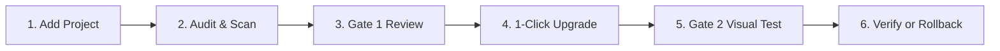

# Drupal Upgrade Workbench — Complete Operator Guide

The **Drupal Upgrade Workbench** is the main, centralized single-page visual application for conducting deterministic, zero-risk Drupal 10 → Drupal 11 upgrades across any number of Drupal projects.

> [!NOTE]
> **Centralized & Non-Invasive**: The Drupal Upgrade Workbench is the main hub and runs standalone. You do **not** need to embed or commit upgrade tooling into individual Drupal repositories. Simply register your Drupal project paths into the Workbench.

---

## 1. Starting the Workbench

To launch the local web server:

```bash
cd /path/to/drupal-upgrade-workbench
./bin/d11 dashboard --port 8765
```

The server binds to `127.0.0.1:8765` and automatically manages its own Python virtual environment (`.venv`). Once started, navigate to:

👉 **[http://localhost:8765](http://localhost:8765)**

To run headless without opening a browser window automatically, pass `--no-open`:
```bash
./bin/d11 dashboard --port 8765 --no-open
```

---

## 2. The 6-Stage Pipeline

The Workbench guides developers through six distinct pipeline stages:



### Stage 1: Add Project & Environment Auto-Detection
1. Click **+ Add Project** in the sidebar.
2. Fill in the project details:
   - **Project Name**: An arbitrary slug identifier (e.g., `my-drupal-site`).
   - **Source Directory**: The absolute path to your local Drupal repository (e.g., `/path/to/my-drupal-site`).
   - **Site URL**: The local development URL (e.g., `http://my-drupal-site.docksal.site` or `https://my-drupal-site.ddev.site`).
   - **Sitemap / Route Paths (Optional)**: Specific URLs to include in baseline visual tests.
3. Click **Add project → Scan**.
4. The Workbench automatically inspects your environment, detecting:
   - Container runtime (**Docksal**, **DDEV**, **Lando**, or **Docker Compose**).
   - Docker network (e.g., `my-drupal-site_default`).
   - Active database credentials and webroot (`web/`, `docroot/`, or root).

---

### Stage 2: Audit & Disposable Scanner
- Audits are **100% non-destructive**.
- Upgrade Status and Drupal Rector run inside an isolated MariaDB analysis container (`db:3306`).
- Your live development database and working directory are **never modified** during the audit.
- Scans collect:
  - Extension inventory (contrib modules, themes, profiles, and custom code).
  - Deprecation notices and PHPStan static analysis findings.
  - Candidate releases on Drupal.org supporting Drupal 11 (`core_version_requirement: ^10 || ^11`).
  - Baseline route captures for before/after visual regression comparison.

---

### Stage 3: Gate 1 Review & Compatibility Decision Matrix

The Workbench displays the **Gate 1 Upgrade Proposal**:

#### Extension Classification Summary
- **Ready / Keep**: Modules that already support Drupal 11 with **zero deprecations and zero code findings**.
- **Compatible Release**: Contrib extensions with an available Drupal.org release compatible with Drupal 11.
- **Available Patch**: Extensions where community patches provide Drupal 11 compatibility.
- **Manual Remediation**: Custom code requiring Rector refactoring or Drupal 11 API changes.
- **Remove**: Obsolete modules superseded by Drupal 11 core (e.g. `advagg`, `advagg_mod`, `quickedit`).

#### The Strict "Keep" Rule
> [!IMPORTANT]
> In the Drupal 11 Upgrade Toolkit, an extension may **only** be kept (`action: "keep"`) if it is **100% clean**:
> `status === "ready" and deprecations === 0 and phpstanIssues === 0`.
> 
> If an extension has any deprecation notices, assigning `keep` triggers a hard blocker:
> *"Keep is allowed only when completed evidence establishes Drupal 11 compatibility"*.
> The Workbench auto-decide engine automatically converts compatible versions with deprecations to `compatible_release` to satisfy Gate 1 safety.

#### Gate 1 Approval Gate
When all extensions are resolved (0 unresolved blockers) and risk is `Conditional Go` or `Go`, the **Start 1-Click Upgrade →** button becomes active.

---

### Stage 4: 1-Click Upgrade Execution
When you click **Start 1-Click Upgrade →**:
1. A **Safety Confirmation Modal** opens showing:
   - Extensions to be removed.
   - Modules to be upgraded.
   - Refactoring patches to be applied.
2. Clicking **Confirm & Start Upgrade →** executes:
   - **Database Snapshot**: Takes a gzipped MySQL dump (`pre-upgrade.sql.gz`).
   - **Zero-Copy Git Checkpoint**: Records the active Git commit hash (`gitHead`).
   - **Module Uninstallation**: Uninstalls obsolete modules (e.g. `advagg`) cleanly via Drush.
   - **Custom Code Refactoring**: Applies Rector-generated diffs and updates `.info.yml` core requirements.
   - **Composer Execution**: Updates core to **Drupal 11.4.x** and Drush to **13.x**.
   - **Database Updates**: Runs `drush updatedb --yes`.
   - **Cache Rebuild**: Runs `drush cache:rebuild`.
   - **Bootstrap Probe**: Verifies `drush core:status` (`drupal-version: 11.4.x`, `db-status: Connected`).

---

### Stage 5: Gate 2 Visual Regression & Difference Viewer
- Captures automated screenshots across baseline routes on the upgraded site.
- Compares baseline vs. upgraded images using pixel-by-pixel visual diffing.
- Highlights visual mismatches or regressions in the **Visual Review** pane.
- Confirms HTTP status codes and route accessibility.

---

### Stage 6: Instant 1-Click Rollback
At any point after or during an upgrade rehearsal, you can restore your site with a single click:
1. Navigate to the **Rollback** tab or click **Rollback to Pre-Upgrade State**.
2. Click **Confirm Rollback**.
3. The engine automatically:
   - Drops all tables and restores the `pre-upgrade.sql.gz` database snapshot.
   - Resets the Git working tree to the recorded pre-upgrade commit (`gitHead`).
   - Runs `composer install` to restore the pre-upgrade `vendor/` directory.
   - Rebuilds Drupal caches (`drush cache:rebuild`).
   - Verifies site health (returns to Drupal 10.x, HTTP 200).
   - Leaves your Git working tree **100% clean**.

---

## 3. Workbench Settings & AI Providers

Click the **Settings (⚙️)** icon in the sidebar to configure AI providers:
- **Claude Code**: Anthropic API key or local Claude CLI path.
- **Gemini CLI / AGY**: Google AI API key or Vertex credentials.
- **Codex / OpenAI**: OpenAI API key.
- **Local Ollama**: Local model endpoint (e.g., `http://localhost:11434`).

AI providers assist in drafting refactoring patches for complex custom code, but all diffs are validated by deterministic parsers before application.

---

## 4. Workbench Troubleshooting

### 1. "Only one workflow may run at a time"
If a previous scan or rehearsal was interrupted:
```bash
rm -f ~/.d11/workflow.lock
```

### 2. "58 extension compatibility decisions remain unresolved"
This error occurs if older cached client-side JavaScript attempted to set `action: "keep"` on modules that have deprecation notices.
- **Fix**: Perform a hard refresh in your browser:
  - **macOS**: `Cmd + Shift + R`
  - **Linux / Windows**: `Ctrl + F5`
- The updated Workbench logic will automatically classify those modules as `compatible_release`.

### 3. "Source runtime is stopped or ambiguous"
The Workbench matches your project directory against active Docker containers.
- Check active containers: `fin ps`, `ddev list`, or `docker ps`.
- If you have multiple copies of a repository (e.g. `my-site` and `my-site-upgrade-test`), stop the inactive one:
  ```bash
  cd /path/to/inactive-project && fin stop
  ```
- Restart your active project: `fin up` or `ddev start`.

### 4. Restarting the Dashboard Service
```bash
# Terminate existing server on port 8765
lsof -i :8765 | awk 'NR>1 {print $2}' | xargs kill -9

# Restart cleanly from workbench directory
./bin/d11 dashboard --port 8765 --no-open
```

